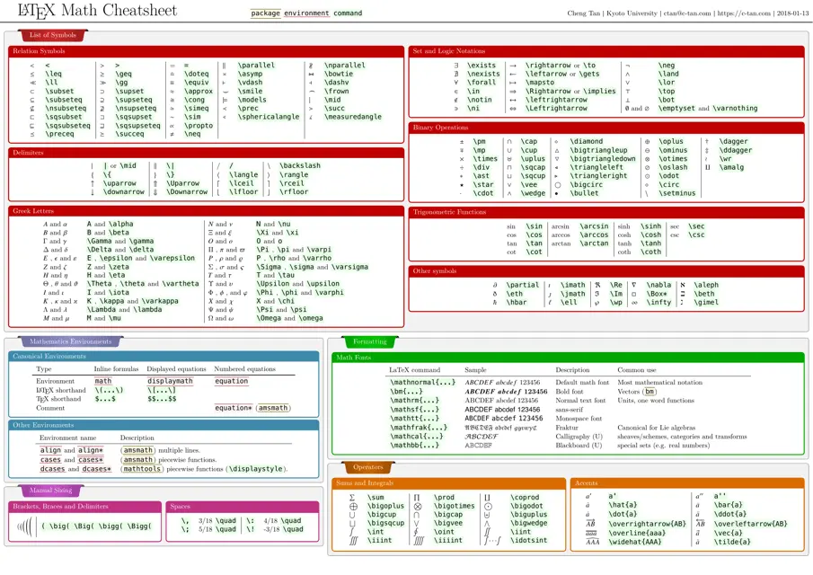

# CSE 21 - FA25 Group Works

Set up your repo with Fork another repo. [Github Start Up](./doc/github_startup.md).

# Assignments

[Assignment 1](./hw/assignment1.md) | 

# Latex
Provides a high-level, descriptive markup language to utilize:
- Document Layout
- Mathematical Expressions
- Footnotes
- etc

Check [here](https://quickref.me/latex) for more inforation on **Latex**
