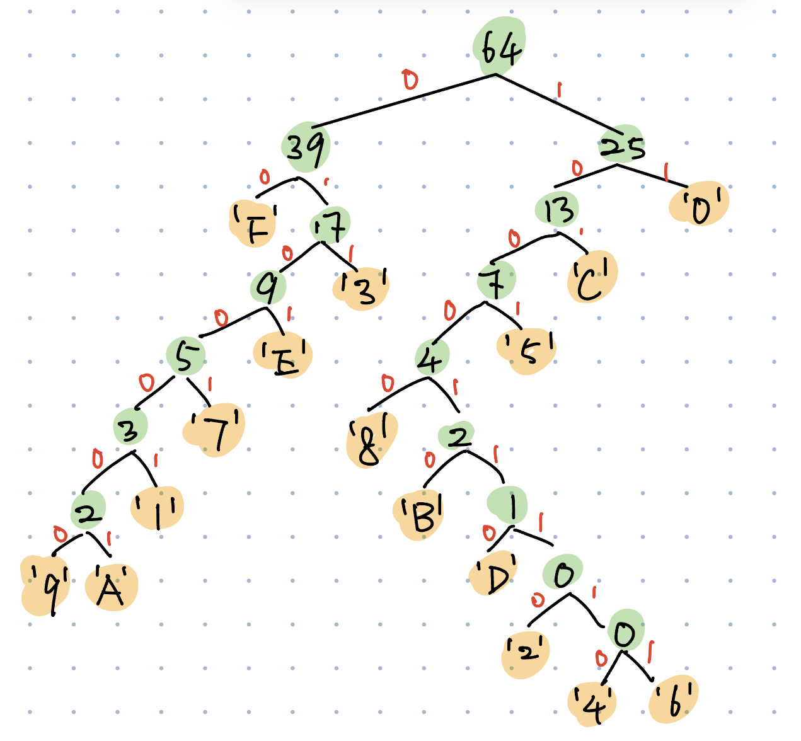

# Assignment 7

Contributors:
- Yezhi Wu, yew020@ucsd.edu
- Andrew Le, aal034@ucsd.edu
- Theo Lee, thl030@ucsd.edu
- Woosik Kim, wok017@ucsd.edu

Due: November 25 2025

---

### Question 1

You own an pizza shop. You wish to encode each order with a fixed length binary string ( in order to efficiently store the orders in your computer.)

A single order consists of a size, a type of crust, a type of sauce, and toppings.

You can choose a size : small, medium, large

The crust choices are : thin, thick, stuffed, gluten-free

The sauce choices ae : tomato, pesto

Then there are toppings that you have the option to select or not. The toppings are : pepperoni, olives, mushrooms, sausage, eggplant. ( You can select any number of the toppings including selecting 0 toppings.)

**a)** How many bits does it require to encode each order with the fewest bits using a fixed-length encoding ?

Solution :

* Size : small, medium, large $\rightarrow$ 3 choices.

Smallest k with $2^k$ $\ge$ 3 is k = 2. $\rightarrow$ need 2 bits.

* Crust : thin, thick, stuffed, gluten-free $\rightarrow$ 4 choices.

$2^2$ = 4 $\rightarrow$ need 2 bits.

* Sauce : tomato, pesto $\rightarrow$ 2choices.

$2^1$ = 2 $\rightarrow$ need 1 bit.

* Toppings : 5 toppings, each can be on or off. So number of combinations = $2^5$ = 32.

$2^5$ = 32 $\rightarrow$ needs 5 bits.

Total bits for one full order : \
2(size) + 2(crust) + 1(sauce) + 5(toppings) = 10bits

Total distinct order = 3 * 4 * 2 * 32 = 768

We need at least [$log_2 768$] = 10 bits for a fixed-length code.

**Answer (a)** : 10 bits.

**b)** Develop your own encoding/decoding algorithm where the code uses this number of bits. (Please
give a brief description of how it works on an particular order.)

* Encoding algorithm :
1. The first 2 bits represent the size.
2. The next 2 bits represent the crust.
3. The next 1 bit represents the sauce.
4. The last 5 bits represent toppings in the order: pepperoni, olives, mushrooms, sausage, eggplant
(1 = included, 0 = not included). \
To encode an order, I look up each category’s bit value and concatenate all 10 bits into one binary string.

* Decoding algorithm :
1. Bits 1-2 $\rightarrow$ size
2. Bits 3-4 $\rightarrow$ crust
3. Bit 5 $\rightarrow$ sauce
4. Bits 6-10 $\rightarrow$ toppings\
I translate each bit section back into its meaning using the tables from the encoding step. \
 If the size bits equal 11 (an unused combination), I mark the code as “not decodable.”

 **c)** Use your encoding to encode the following orders : 

### Size ( 2 bits )
- 00 = small
- 01 = medium
- 10 = large
- 11 = should not use this

### Crust ( 2 bits )
- 00 = thin
- 01 = thick
- 10 = stuffed
- 11 = gluten-free

### Sauce ( 1 bit )
- 0 = tomato
- 1 = pesto

### Toppings ( 5 bits )
1. pepperoni
2. olives
3. mushrooms
4. sausage
5. eggplant

For each topping :
* 1 = topping is included
* 0 = topping is not included
--- 
* size : small ( 00 )
* crust : gluten - free ( 11 )
* sauce : pesto ( 1 )
* toppings : eggplant ( 00001 )

Binary string : 0011100001

* size : large ( 10 )
* crust : thin ( 00 )
* sauce : tomato ( 0 )
* toppings : pepperoni, olives, sausage, eggplant ( 11011 )

Binary string : 1000011011

**d)** Use your decoding to decode the following strings: (put “not decodable” if you can’t decode the
string and give a reason why it is not decodable. Otherwise, you are not required to provide
justification.)

* 0010111010

Bits 1-2 : 00 $\rightarrow$ size = small \
Bits 3-4 : 10 $\rightarrow$ crust = stuffed \
Bits 5 : 1 $\rightarrow$ sauce = pesto \
Bits 6-10 : 11010 $\rightarrow$ toppings \
pepperoni = 1 $\rightarrow$ yes \
olives = 1 $\rightarrow$ yes \
mushrooms = 0 $\rightarrow$ no \
sausage = 1 $\rightarrow$ yes \
eggplant = 0 $\rightarrow$ no \
Decoded order 1 : size small, crust stuffed, sauce pesto, toppings : pepperoni, olives, sausage.

* 1010101010

Bits 1-2 : 10 $\rightarrow$ size = large \
Bits 3-4 : 10 $\rightarrow$ crust = stuffed \
Bits 5 : 1 $\rightarrow$ sauce = pesto \
Bits 6-10 : 01010 $\rightarrow$ toppings \
pepperoni = 1 $\rightarrow$ no \
olives = 1 $\rightarrow$ yes \
mushrooms = 0 $\rightarrow$ no \
sausage = 1 $\rightarrow$ yes \
eggplant = 0 $\rightarrow$ no \
Decoded order 2 : size large, crust stuffed, sauce pesto, toppings : olives, sausage.

---

### Question 2
In classic 8-bit games like Super Mario Bros., character sprites are made up of small pixel images. The Bullet Bill sprite is 16 pixels wide and 16 pixels tall and is black and white.

Each color can be represented by 1 bit: 0 = white 1 = black

**a).** How many bits are required to encode this image by encoding each pixel with 2 bits?

$$16 \text{ pixels } \times 16 \text{ pixels } \times 2 = 2$$

**b).** Huffman encoding is sometimes used in image compression.

We can use hexadecimal to encode each of the squares into a single hexadecimal character: { 0, 1, 2, 3, 4, 5, 6, 7, 8, 9, A, B, C, D, E, F }

The hexadecimal characters for this image are:
Then we compute the frequency table of the hexadecimal characters and build a Huffman code based on that. Then encode the hexadecimal string using the Huffman code.

Here is the frequency table for this particular image (there are a total of 64 hexadecimal characters that make up the image.):

|Character|0|1|2|3|4|5|6|7|8|9|A|B|C|D|E|F|
|---------|---|---|---|---|---|---|---|---|---|---|---|---|---|---|---|---|
|Frequency|12|1|0|8|0|3|0|2|2|1|1|1|6|1|4|22|

**i.** Draw the huffman tree for the set of frequencies.

**ii.** Give the code for each character.
- 0: 11
- 1: 010001
- 2: 10001110
- 3: 011
- 4: 100011110
- 5: 1001
- 6: 10001111
- 7: 01001
- 8: 10000
- 9: 0100000
- A: 0100001
- B: 100010
- C: 101
- D: 11
- E: 0101
- F: 00

**iii.** Calculate the total number of bits needed to encode this particular image of Bullet Bill using the coding.

|Character|Frequency|Code Length|Total Bits|
|-|-|-|-|
|F|22|2|44|
|0|12|2|24|
|3|8|3|24|
|C|6|3|18|
|E|4|4|16|
|5|3|5|15|
|7|2|5|10|
|8|2|5|10|
|1|1|6|6|
|9|1|6|6|
|A|1|6|6|
|B|1|6|6|
|D|1|6|6|
|2|0|8|0|
|4|0|8|0|
|6|0|7|0|

Therefore, $44+24+24+18+16+15+10+10+6+6+6+6+6+0+0+0=191$

### Question 4

An composition of a non-negative integer n into k parts is a k-tuple of non-negative integers that sum
up to n. For example, (2, 0, 1, 3, 0, 4) and (0, 0, 10, 0, 0, 0) are both compositions of 10 into 6 parts.

a) What is the minimum number of bits necessary to uniquely encode each compositions of 10 into
6 parts?

**Solution**:

Number of ways to encode each composition of 10 into 6 parts: $\dbinom{10 + 6 -1}{6 - 1} = \dbinom{15}{5}$

Number of bits necessary to uniquely code each compositions of 10 into 6 parts:
$$\displaystyle\log_2\dbinom{15}{5} \approx 12 \text{ bits} $$

b) Develop an encoding strategy and encode (2, 0, 1, 3, 0, 4) and (0, 0, 10, 0, 0, 0) using the number of bits calculated from the previous part.

**Solution**:

We use Stars and Bars method. We convert the compositions of 10 into 6 parts into fixed length 15 bits binary strings, each of which uses 5 "1"s to separate 6 parts and "0"s to represent the number of units that part has. So, (2,0,1,3,0,4) can be converted to 001101000110000.

 We then put them in a dictionary of Rank 15 choose 5 using lexicographical order. Now, there are a total of $\dbinom{15}{5} = 3003$ compositions. Hence, we only need a 12 bit binary string with 5 "1"s to encode the decimal position number of each composition.

 We do that by write the numbers n-1 down to 0 under each bit of the 15 bit string from left to right.  Then, we write the numbers k down to 1 under each "1" from left to right. For each "1", we add the first number "chose" the second number. If first number is smaller than the second number, the combination is 0.

 This is the shortcut of the ranking algorithm for Rank 15 Choose 5.

 Using this method, (2,0,1,3,0,4) is encoded as $\dbinom{12}{5}+\dbinom{11}{4}+\dbinom{9}{3}+\dbinom{5}{2}+\dbinom{4}{1} = 1220$ in decimal and 010001110011 in binary, while {0,0,10,0,0,0} is encoded as $\dbinom{14}{5}+\dbinom{13}{4}+\dbinom{2}{3}+\dbinom{1}{2}+\dbinom{0}{1} = 2717$ in decimal and 1010 1001 1101 in binary.

c) Use your encoding strategy to decode the following string:
$$0011 1010 1100$$

Solution:

To decode a string representing the position of a n = 15-bit string with k = 5 "1"s, we initialize output to be a 15-bit string of "0"s. Let r that position string in decimal. While k > 0, we find the largest x such that $\dbinom{x}{k}\le r$, then put a 1 in position x (counting from the right), then substract $\dbinom{x}{k}$ from r and substract 1 from k. Using this method, the string $001110101100_2 = 940_{10}$ will start with r = 940, n = 15, and k = 5. After decoding, we find out that the string represents the number 001001001000110. We treat the "1"s as bars and the "0"s as stars, and we can decode to the composition of {2,2,2,3,0,1}

Final answer: {2,2,2,3,0,1}
Due: November  25 2025

