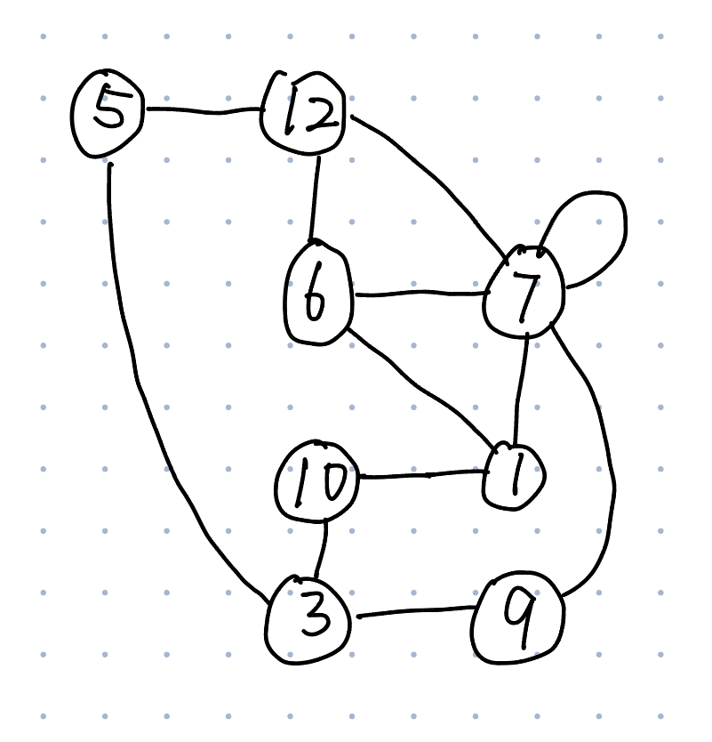

# Assignment 8

Contributors:

- Yezhi Wu, yew020@ucsd.edu
- Andrew Le, aal034@ucsd.edu
- Theo Lee, thl030@ucsd.edu
- Woosik Kim, wok017@ucsd.edu

Due: December 2 2025

---

### Question 2

Dominos is a game played with collection of tiles that have a number of “pips” on each side of the domino. For this problem, we will consider “double-twelve” dominos meaning that the number of pips can range anywhere from 0 to 12 on each side.

A “train” of dominos is a sequence of dominos such that two dominos next to each other “connect” with the same number of pips. You are given a collection of n dominos from the set of double-twelve dominos. You wish to determine if it is possible to make a train that uses all n dominos (each exactly once.)

For example: the collection: { (3, 5), (4, 5), (3, 3), (5, 11), (10, 5), (10, 4) } can be arranged in a train that includes all dominos:(11, 5), (5, 10), (10, 4), (4, 5), (5, 3), (3, 3)

On the other hand, the collection: { (3, 5), (4, 5), (3, 3), (5, 11), (10, 5) } cannot be arranged in a train that includes all dominos.

**a)**. Model this problem as a graph problem in such a way that, given the collection of n dominos, build a graph G such that G has a Eulerian path if and only if the collection of n dominos can be arranged in a train that includes all dominos. (An Eulerian path is a path that goes through each edge exactly once.) (Your answer should be a description of a graph for a general collection of dominos. You must have a clear description of the vertices and a clear rule about when two vertices are connected by an edge and whether or not the edge is directed or undirected.)

**Solution:** Since an Eulerian part is defined as a trail in a finite graph which visist every edge exacly once, the domaines themselfe must be the edges. 

For vertices, $V=\{0,1,2,3,4,\dots ,12\}$ which is the number of pips on the faces of the dominoes.

For edges, create an undirected edge between two vertices $u$ and $v$ for each dominoes $(u,v)$ in the collection. The other situation could be a double $(u,u)$, which was crated by a self-loop on vertex.

The reason of this graphs works on Eulerian is :

Suppose that the graph has an Eulerian path from $(v_1,\dots ,v_n)$. Then, for each edges travers by using the specific domino from the collection exactly onece. Since the edges in the path are connected by both normal vertices and double vertices, the corresponding dominos share the common number of pips at $v_i$ and $v_{i+1}$. Therefore, the sequence $(v_1,\dots ,v_n)$ of edges in the Eulerian path corresponds to a valid train that uses all dominos.

**b)**. If there are n dominos, how many vertices and edges does your graph have (worst-case using Big-O notation)

**Solution**: 

In the worst case of vertices, the number of vertices is bounded by the number of pip valuse, which is the set $\{0,1,\dots ,12\}$. Therefore, there are $13$ vertices. $|V| \in O(1)$

In the worst case of edges, since every domino must be connected by exactly one edge, the number of edges is exactly $n$. Therefore, $|E| \in O(n)$

**c)**. Draw the graph for the input: {(6, 7), (10, 1), (3, 9), (12, 6), (9, 7), (7, 7), (5, 12), (7, 12), (3, 5), (3, 10), (1, 7), (6, 1)} (Try your best to draw your graph as a planar graph meaning that none of the edges cross.)



**d)**. Identify a Eulerian path in the graph you built for part c and use that to construct a valid train.

- Vertex 1 -> (6,7,10): **Degree 3, Odd**
- Vertex 3 -> (5,9,10): **Degree 3, Odd** 
- Vertex 5 -> (3,12): Degree 2, Even
- Vertex 6 -> (1,7,12): **Degree 3, Odd** 
- Vertex 7 -> (1,6,9,12) + (itself): Degree 6, Even
- Vertex 9 -> (3,7): Degree 2, Even 
- Vertex 10 -> (1,3): Degree 2, Even 
- Vertex 12 -> (5,6,7): **Degree 3, Odd** 

Since it is more than 2 even degrees, there is no Eulerian path exists.

Valid train: (12,6)(6,7)(7,12)(12,5)(5,3)(3,9)(9,7)(7,7)(7,1)(1,10)(10,3)

By removing the (6,1) which will case vertex 1 and 6 to be even degress. Now, it is a valid Eulerian path.

---

### Question 3

A labeled 0-rooted tree with $n$ vertices is a rooted tree with each vertex labeled a different integer from 0 to n - 1 such that 0 is the root.

Consider the following encoding scheme for labeled 0-rooted trees with 8 vertices that uses 21 bits:

1. First convert the tree into a 7-tuple where the 1st entry is the parent of vertex 1, the 2nd entry is the parent of vertex 2, and so on.
2. Then convert the 7-tuple into a 21-bit string by converting each entry of the 7-tuple into a 3-bit integer in binary.

For Example: For the following tree:

The 7-tuple would be: (7, 7, 0, 1, 7, 4, 0) and the corresponding encoding: 111 111 000 001 111 100 000.

Encoding Table

| Decimal | Binary |
| :-----: | :----: |
|    0    |  000  |
|    1    |  001  |
|    2    |  010  |
|    3    |  011  |
|    4    |  100  |
|    5    |  101  |
|    6    |  110  |
|    7    |  111  |

**(a)** Use the encoding on the following trees: (no justification necessary)

Solution:

**(i)** Tree 1:

7-tuple: (0, 5, 6, 5, 1, 0, 0)

$$
000\ 101\ 110\ 101\ 001\ 000\ 000
$$

**(ii)** Tree 2:

7-tuple: (0, 0, 1, 1, 2, 2, 3)

$$
000\ 000\ 001\ 001\ 010\ 010\ 011
$$

**(iii)** Tree 3:

7-tuple: (0, 0, 0, 0, 0, 0, 0)

$$
000\ 000\ 000\ 000\ 000\ 000\ 000
$$

**(b)** Draw the labeled tree that is encoded by the string: (no justification necessary)

$$
101\ 100\ 000\ 111\ 011\ 101\ 000
$$

Solution:

7-tuple:

$$
(5, 4, 0, 7, 3, 5, 0)
$$

Parent relationships:

| Vertex | Parent |
| :----: | :----: |
|   1   |   5   |
|   2   |   4   |
|   3   |   0   |
|   4   |   7   |
|   5   |   3   |
|   6   |   5   |
|   7   |   0   |

Tree:

```
       0
      / \
     3   7
     |   |
     5   4
    / \   \
   1   6   2
```

**(c)** Is this encoding a bijection from the set of labeled 0-rooted trees with 8 vertices to the set of 21-bit strings?

Solution:

No, this encoding is not a bijection.

The encoding is injective (one-to-one) but not surjective (onto).

Counterexample:

Consider the 21-bit string:

$$
001\ 001\ 001\ 001\ 001\ 001\ 001
$$

This corresponds to the 7-tuple (1, 1, 1, 1, 1, 1, 1), which means vertex 1's parent is vertex 1 itself.

A vertex cannot be its own parent, so this is not a valid tree.

Since there exists a 21-bit string that doesn't correspond to a valid labeled 0-rooted tree, the encoding is not surjective, therefore not a bijection.

---
