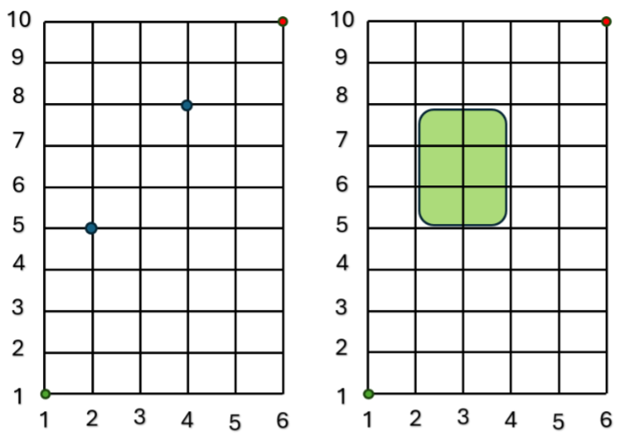

# CSE21: Math/Algorithms & Systems Analysis
## Assignment 2
## Due Date: 
- Jason Wang, jaw073@ucsd.edu
- Joshua Citrin, jcitrin@ucsd.edu
- Benjamin Michael, bemichael@ucsd.edu

---
## Question 1
### Part a
Suppose you are giving out candy to trick-or-treaters. There is a group of 10 different trick-or-treaters that come to your door. You must give
each of the 10 trick-or-treaters exactly one candy. You have an unlimited supply of 6 different candy bars: Snickers, Milky way, 3 Musketeers,
Almond Joy, Twix, Kit Kat.
1. How many differnet ways can you hand out one candy bar to each fo the 10 trick-or-treaters?
2. How many different ways can you hand out candy bar to each of the 10 trick-or-treaters if you hand out at least one candy bar of each variety?
3. How many differnet ways can you hand out one candy bar to each of the 10 trick-or-treaters if you hand out exactly 6 Snickers

### Part 2
Suppose you are *leaving* out a bowl of 10 candies to trick-or-treaters. You have an unlimited supply of 6 different candy bars:Snickers, Milky way, 3 Musketeers, Almond Joy, Twix, Kit Kat.
1. How many different ways can you select 10 candies for the bowl (choosing from your assort-
ment of 6 different candies)?
2. How many different ways can you select 10 candies for the bowl so that there is at least one
candy bar of each variety?
3. How many different ways can you select 10 candies for the bowl so that the bowl has exactly
6 Snickers?

## Question 2
Suppose you are traveling from the bottom-left corner of a $10 \times 6$ grid of blocks and you wish to get
to the top-right corner only using up and right movements:

1. How many paths are there from the bottom-left corner to the top-right corner using right and up
moves so that you go through at least one of the two blue dots in the first picture?
2. How many paths are there from the bottom-left corner to the top-right corner using right and up
moves so that you avoid the green area in the second picture?

## Question 3
Comupute the number of *integer solutions* for each equation:
### Part a
$$a_1 + a_2 + a_3 + a_4 + a_5 = 50$$

- $1 \leq a_1$
- $2 \leq a_2$
- $3 \leq a_3$
- $4 \leq a_4$
- $5 \leq a_5$

### Part b
$$a_1 + a_2 + a_3 + a_4 + a_5 = 50$$

- $0 \leq a_1$
- $0 \leq a_2$
- $0 \leq a_3$
- $0 \leq a_4$
- $10 \leq a_5 \leq 20$

### Part c
$$a_1 + a_2 + a_3 + a_4 + a_5 = 50$$

- $0 \leq a_1 \leq 15$
- $0 \leq a_2 \leq 15$
- $0 \leq a_3 \leq 15$
- $0 \leq a_4 \leq 15$
- $0 \leq a_5 \leq 15$

## Question 4
1. For integer $n \geq 0$, consider the identity: 

$$\binom{n+2}{3} = (1)(n) + (2)(n-1) + (3)(n-2)+...+(n-1)(2)+(n)(1)$$

Prove the identity combinatorially by counting the same set in two different ways or by counting two different sets and establishing a bijection between them.
(Hint: count the number of fixed binary strings based on the position of the middle "1")

2. For integers $n > k \geq 0$, consider the identity: 

$$P(n,k) = P(n-1, k) + kP(n-1, k-1)$$

Prove the identity combinatorially by counting the same set in 2 different ways or by counting two different sets and establishing a bijection between them.
